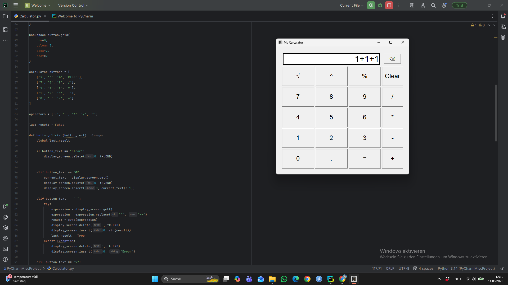
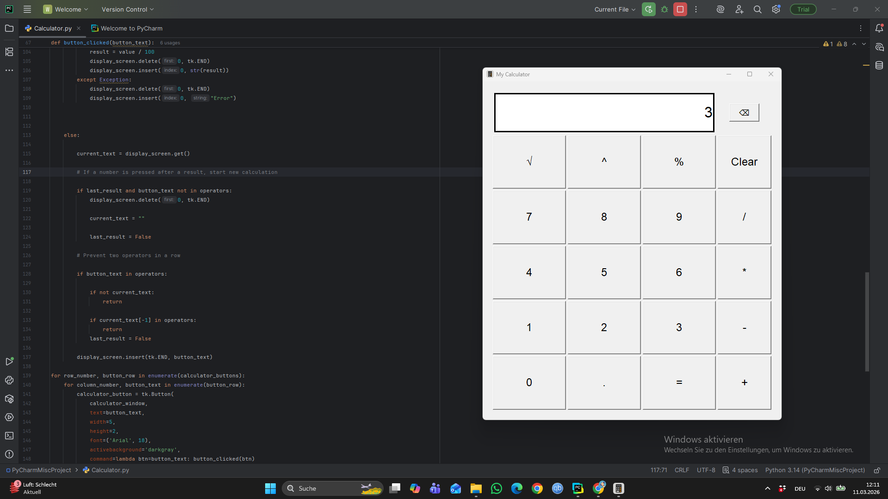

# Python-Calculator
Simple python Calculator with a basic GUI 
Project: GUI Calculator
Author: Omid Shah Amir Sayed

## Description
This project is a graphical calculator written in Python using the Tkinter library.  
It provides a user-friendly interface that allows users to perform basic mathematical
operations such as addition, subtraction, multiplication, and division. Additional
functions like square root, percentage, and exponentiation are also included.

The application is designed to demonstrate fundamental programming concepts,
including event-driven development, GUI design, and expression evaluation.

---

## Features
- ➕ Addition
- ➖ Subtraction
- ✖️ Multiplication
- ➗ Division
- √ Square root
- % Percentage calculations
- ^ Exponentiation (power)
- 🖱️ Button-based input
- ⌨️ Keyboard input support
- 🖥️ Standalone executable (.exe) – Python installation not required

---

## Technologies Used
- **Python 3**
- **Tkinter** – for the graphical user interface
- **math** module – for advanced mathematical functions
- **eval()** – for evaluating mathematical expressions
- **PyInstaller** – for creating the standalone executable

---

## How the Program Works
The calculator is built using an **event-driven architecture**:

1. **Graphical User Interface (GUI)**  
   The interface is created using Tkinter and includes:
   - A display field where numbers and results are shown
   - Buttons for digits and mathematical operations

2. **Button Interaction**  
   Each button is linked to the `button_clicked()` function, which processes the
   input and determines the appropriate action.

3. **Mathematical Calculations**
   - `eval()` is used to evaluate mathematical expressions such as `5 + 3 * 2`.
   - `math.sqrt()` is used to calculate square roots.

4. **Keyboard Support**  
   The calculator also supports keyboard input through the `key_pressed()` function,
   allowing users to interact with the application without using the mouse.

---

## Example

After launching the application, a graphical window appears where users can:

- Enter numbers using on-screen buttons or the keyboard
- Select mathematical operations
- Instantly view the calculated result on the display


## Screenshot

<p align="center">
  
  
</p>
---

## Running the Program

### Option 1 – Using the Executable (Recommended)
You can run the calculator by simply double-clicking:

### Option 2 – Running from Source Code
If you prefer to run the program from the source code:

```bash
python calculator.py
